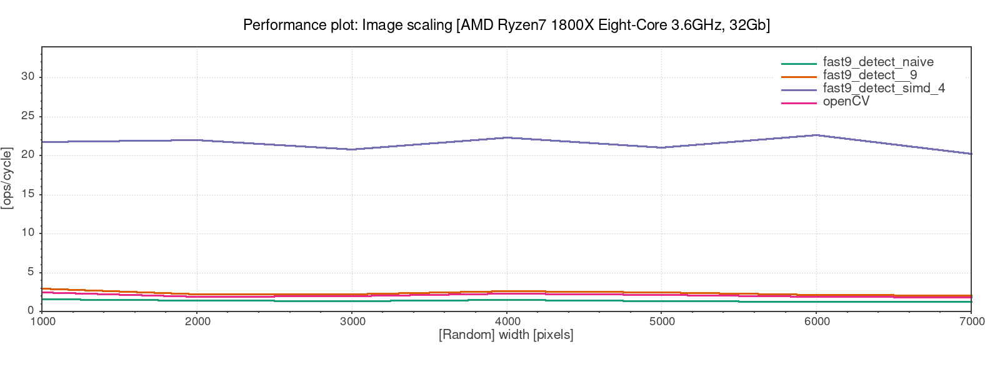
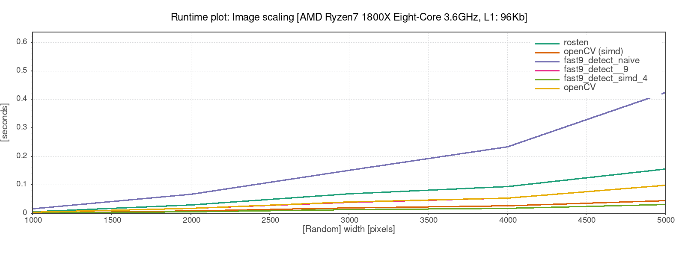

# TestAndPlot
Note: This repo is a snippet from another project and does not compile. (However, this might change in the future). It is meant for educational purposes only.

## Design goals
The tester class should provide exactly one function to run tests. This function takes a type and parameter struct. From this input the tester should statically determine what tests to run, detect illegal combination (scaling test with an input that does not support scaling), detect return types and take action depending on those (for example free memory).
When the benchmarks have finished draw the plots with gnuplot.  

## Definitions
### Performance Plots
Performance is defined as operations per cycle. To plot a performance plot two things total operations and cycles need to be counted. While cycles can be querried from the cpu, operations need to be counted manually. This is a not a trivial thing.
There are some tools that can be used like valgrind or intel pin. However, those tools use extensive instrumenting and cannot be used from C++. Or only with difficulties. 

### Runtime Plots

## The problem of counting operations